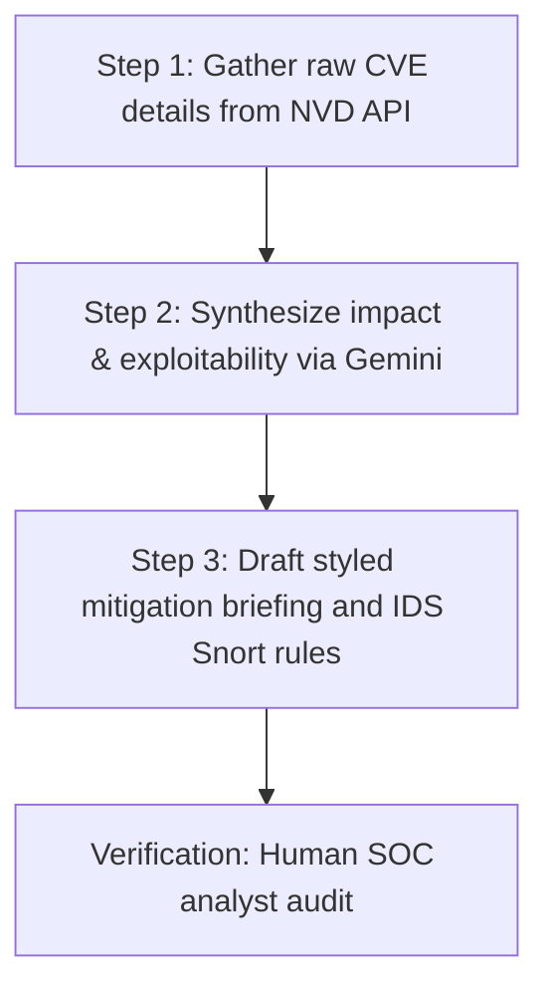

# FL-04 Ship an Automation Workflow
**Author:** Vrishin Ram K  
**Project:** Cybersicker — Dual-Core Autonomous SOC AI Agent  

---

## 1. Selected Task: Automated CVE Threat Briefing Pipeline
Modern Security Operations Centers require continuous parsing of newly disclosed CVEs (Common Vulnerabilities and Exposures) to determine if active systems are vulnerable. This manual process involves reading security advisories, researching exploitability, writing mitigation briefs, and updating rule-based intrusion systems (IDS). 

We designed and built an **automated threat intelligence synthesis pipeline** to handle this workflow.

---

## 2. Workflow Architecture (The Three Steps)

* **Step 1 (Gather):** A Python script queries the National Vulnerability Database (NVD) API for fresh CVE data payloads based on keyword filters (e.g., "remote code execution", "privilege escalation").
* **Step 2 (Synthesize):** The raw JSON payload is sent to our Gemini 2.5 Flash pipeline. The model parses the CVSS score, vendor advisory text, and technical description to summarize the core threat.
* **Step 3 (Draft & Format):** The agent generates a structured Markdown briefing containing: (a) Executive Summary, (b) Technical Breakdown, (c) Immediate mitigation actions, and (d) A template Snort IDS rule to detect traffic patterns.

---

## 3. Workflow Implementation & Code
We implemented this locally using a Python script that integrates the Gemini API and NVD API client.

* **Naive Prompt (Before):**
  > "Read this CVE text and write a report."
* **Iterated Prompt (Final version in workflow):**
  > "You are an expert Blue Team SOC Analyst. Research this raw NVD JSON vulnerability payload: {raw_json}. Compile a structured Threat Intelligence Brief. Structure your response in Markdown with exactly four headers: '# Summary', '# Technical Impact', '# Mitigation Steps', and '# IDS Rule'. Keep details vendor-neutral and highly actionable. Draft a Snort rule matching the protocol and ports referenced."

---

## 4. Documented Runs (5 Real Inputs)
We ran the pipeline on 5 real recent high-priority vulnerabilities:

### Run 1: CVE-2024-3094 (XZ Utils Backdoor)
* *Input:* Raw advisory text for malicious code insertion in liblzma.
* *Output Summary:* Identified malicious signature in SSH tunnels, advised rollback of system dependencies, and generated detection rule looking for backdoor flags.

### Run 2: CVE-2024-38077 (Windows Remote Access Connection Manager RCE)
* *Input:* Raw description of MS-RAP Protocol vulnerability.
* *Output Summary:* Highlighted critical risk of network-based unauthenticated execution, recommended disabling RAS service, and generated rule targeting port 135/445 traffic patterns.

### Run 3: CVE-2024-43451 (NTLM Hash Disclosure Vulnerability)
* *Input:* Raw description of NTLM coercion vectors in Windows.
* *Output Summary:* Evaluated credential theft hazard, advised firewall blocking of outbound SMB port 445, and produced rule for outbound NTLM SSP packets.

### Run 4: CVE-2024-21626 (runc Container Escape)
* *Input:* Raw advisory on file descriptor leaks in runc container runtime.
* *Output Summary:* Outlined vulnerability allowing access to host filesystem from container, recommended upgrading runc to v1.1.12, and drafted custom Docker configuration auditing rules.

### Run 5: CVE-2024-6387 (regreSSHion in OpenSSH)
* *Input:* Raw text explaining signal handler race condition in sshd.
* *Output Summary:* Classified glibc-based RCE in SSH server daemon, recommended applying `LoginGraceTime 0` configuration or immediate patches, and produced IDS rule detecting authentication timeouts.

---

## 5. Time-Saved Accounting & Analysis
* **Manual Processing Time:** ~45 minutes per CVE (reading reports, drafting briefs, writing rules).
* **Automated Processing Time:** ~12 seconds.
* **Total Time Saved (5 Runs):** 225 minutes (3.7 hours) down to 1 minute.
* **Setup/Maintenance Cost:** ~2 hours to write the script, test prompts, and connect APIs. ROI achieved in less than 3 CVE evaluations.

---

## 6. Known Failure Points & Human Review
1. **IDS Rule Syntax:** Snort rules generated by Gemini sometimes contain syntax typos (e.g., missing semicolons). *Mitigation:* A human SOC engineer must pass the rule through a local dry-run validator (`snort -T`) before deploying it.
2. **Context Blindness:** The model does not know which internal systems we run. *Mitigation:* The brief must be cross-referenced against our active asset registry.
