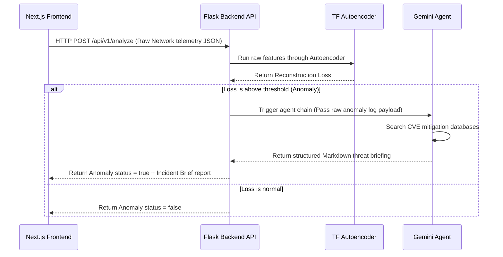

# FL-09 Make It Do Something (Dynamic Feature & Data Flow)
**Author:** Vrishin Ram K  
**Project:** Cybersicker — Dual-Core Autonomous SOC AI Agent  

---

## 1. Selected Dynamic Feature
For a machine learning and cybersecurity portfolio, a static page is insufficient. Our chosen dynamic feature is the **Live Telemetry & Anomaly Analysis API Interface** connecting our Next.js dashboard to our Python threat detection backend.

---

## 2. Technical Explainer: Data Flow & Back-End Architecture

### What is a Backend?
In web applications, the "frontend" is the code running inside the user's browser (rendering HTML, handling scrolling, and styling). The "backend" is the server-side environment that runs on remote servers. It handles processes that the browser cannot (or should not) execute, such as secure API keys storage, resource-heavy machine learning calculations, database queries, and raw operating system interactions.

### Data Flow for Cybersicker Threat Telemetry
Our backend consists of a containerized Python Flask server hosting our trained TensorFlow Autoencoder model and our Gemini 2.5 Flash threat evaluation agent. 

The data flows end-to-end through the following stages:

1. **The Event:** A network capture tool (like `scapy`) records a live packet stream and sends the formatted JSON log payload to our Next.js dashboard.
2. **The Frontend Request:** The Next.js client executes a secure fetch request, sending an HTTP POST payload containing the logs to our remote Flask API endpoint: `/api/v1/analyze`.
3. **The ML Inference:** The Flask server receives the JSON telemetry, scales the numerical values, and feeds them to our **TensorFlow Autoencoder** model. The model computes the reconstruction error.
4. **The Agentic Loop:** 
   * If the error is below the safety threshold, the backend marks the packet as safe and returns a response.
   * If the error exceeds the threshold, the system flags it as an anomaly. The Flask server immediately passes the packet context to the **Gemini 2.5 Flash Agentic Engine** (orchestrated with LangChain).
   * The Agent queries dynamic threat feeds, maps the attack signature to a MITRE ATT&CK ID, and compiles an emergency mitigation playbook.
5. **The Frontend Update:** The Flask backend returns the complete anomaly telemetry and the markdown alert report back to the Next.js client, which updates the dashboard state in real-time, flashing red warning indicators.
